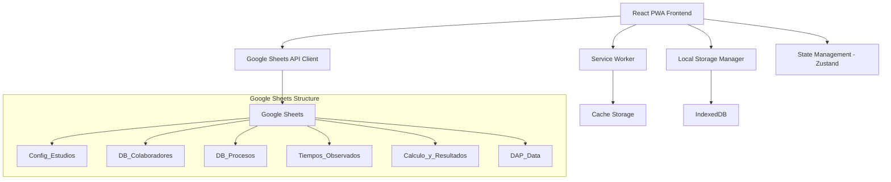

# Design Document - Standard Time Pro

## Overview

Standard Time Pro es una Progressive Web Application (PWA) construida con React que permite a analistas de ingeniería industrial realizar estudios de tiempos completos con sincronización en tiempo real a Google Sheets. La aplicación sigue una arquitectura modular con separación clara de responsabilidades y está optimizada para funcionar en dispositivos móviles, tablets y desktop.

## Architecture

### High-Level Architecture



### Technology Stack

- **Frontend Framework**: React 18 with TypeScript
- **State Management**: Zustand for global state
- **Styling**: Tailwind CSS with responsive design
- **PWA**: Workbox for service worker management
- **API Integration**: Google Sheets API v4
- **Authentication**: Google OAuth 2.0
- **Local Storage**: IndexedDB for offline data
- **Build Tool**: Vite
- **Testing**: Jest + React Testing Library

## Components and Interfaces

### Core Components Structure

```
src/
├── components/
│   ├── auth/
│   │   ├── LoginScreen.tsx
│   │   └── GoogleSheetSetup.tsx
│   ├── layout/
│   │   ├── AppLayout.tsx
│   │   ├── Navigation.tsx
│   │   └── Header.tsx
│   ├── masters/
│   │   ├── CollaboratorManager.tsx
│   │   ├── ProcessManager.tsx
│   │   └── MasterDataForm.tsx
│   ├── study/
│   │   ├── StudyCreation.tsx
│   │   ├── Stopwatch.tsx
│   │   ├── ElementTimer.tsx
│   │   └── CycleManager.tsx
│   ├── evaluation/
│   │   ├── WestinghouseEvaluation.tsx
│   │   ├── ToleranceAssignment.tsx
│   │   └── PerformanceRating.tsx
│   ├── results/
│   │   ├── ResultsDashboard.tsx
│   │   ├── CalculationEngine.tsx
│   │   └── ReportExporter.tsx
│   ├── dap/
│   │   ├── DAPBuilder.tsx
│   │   ├── ActivitySelector.tsx
│   │   ├── DiagramRenderer.tsx
│   │   └── FlowVisualizer.tsx
│   └── common/
│       ├── LoadingSpinner.tsx
│       ├── ErrorBoundary.tsx
│       └── OfflineIndicator.tsx
├── services/
│   ├── googleSheetsService.ts
│   ├── authService.ts
│   ├── calculationService.ts
│   └── offlineService.ts
├── stores/
│   ├── authStore.ts
│   ├── studyStore.ts
│   ├── masterDataStore.ts
│   └── appStore.ts
├── types/
│   ├── study.types.ts
│   ├── masterData.types.ts
│   └── api.types.ts
└── utils/
    ├── timeCalculations.ts
    ├── westinghouseFactors.ts
    └── validators.ts
```

### Key Interfaces

#### Study Management
```typescript
interface Study {
  id: string;
  processId: string;
  collaboratorId: string;
  analyst: string;
  createdAt: Date;
  status: 'active' | 'completed' | 'paused';
  westinghouseFactors?: WestinghouseFactors;
  tolerances?: ToleranceFactors;
}

interface TimeObservation {
  studyId: string;
  elementName: string;
  cycleNumber: number;
  observedTime: number;
  timestamp: Date;
}
```

#### Google Sheets Integration
```typescript
interface SheetsService {
  authenticate(): Promise<void>;
  setupWorkbook(sheetUrl?: string): Promise<string>;
  writeData(sheet: string, data: any[]): Promise<void>;
  readData(sheet: string, range?: string): Promise<any[]>;
  batchUpdate(updates: BatchUpdate[]): Promise<void>;
}
```

## Data Models

### Google Sheets Schema

#### Config_Estudios
| Column | Type | Description |
|--------|------|-------------|
| ID_Estudio | string | Unique study identifier |
| Proceso | string | Process name |
| Colaborador | string | Worker name |
| Analista | string | Analyst name |
| Fecha | date | Study date |
| Habilidad | number | Westinghouse skill factor |
| Esfuerzo | number | Westinghouse effort factor |
| Condiciones | number | Westinghouse conditions factor |
| Consistencia | number | Westinghouse consistency factor |
| Tolerancia_Personal | number | Personal allowance % |
| Tolerancia_Fatiga | number | Fatigue allowance % |
| Tolerancia_Otros | number | Other allowances % |

#### Tiempos_Observados
| Column | Type | Description |
|--------|------|-------------|
| ID_Estudio | string | Study reference |
| Nombre_Elemento | string | Element name |
| Numero_Ciclo | number | Cycle number |
| Tiempo_Registrado | number | Observed time in seconds |
| Timestamp | datetime | Recording timestamp |

#### Calculo_y_Resultados
| Column | Type | Description |
|--------|------|-------------|
| ID_Estudio | string | Study reference |
| Elemento | string | Element name |
| TO_Promedio | number | Average observed time |
| TN | number | Normal time |
| TE | number | Standard time |
| TE_Total | number | Total standard time |

### Local Data Models

#### Offline Queue
```typescript
interface OfflineOperation {
  id: string;
  type: 'CREATE' | 'UPDATE' | 'DELETE';
  sheet: string;
  data: any;
  timestamp: Date;
  retryCount: number;
}
```

## Error Handling

### Error Categories and Responses

1. **Authentication Errors**
   - Token expiration: Auto-refresh with fallback to re-login
   - Permission denied: Clear error message with setup instructions
   - Network errors: Offline mode activation

2. **Google Sheets API Errors**
   - Rate limiting: Exponential backoff with queue management
   - Quota exceeded: User notification with retry scheduling
   - Invalid sheet structure: Auto-repair or guided setup

3. **Data Validation Errors**
   - Invalid time values: Real-time validation with user feedback
   - Missing required fields: Form validation with clear indicators
   - Calculation errors: Fallback to manual entry with warnings

4. **Offline Handling**
   - Connection loss: Automatic offline mode with local storage
   - Sync conflicts: User-guided conflict resolution
   - Data corruption: Backup restoration with user confirmation

### Error Recovery Strategies

```typescript
interface ErrorHandler {
  handleAuthError(error: AuthError): Promise<void>;
  handleAPIError(error: APIError): Promise<void>;
  handleValidationError(error: ValidationError): void;
  handleOfflineError(error: OfflineError): Promise<void>;
}
```

## Testing Strategy

### Unit Testing
- **Components**: React Testing Library for UI components
- **Services**: Jest mocks for Google Sheets API
- **Calculations**: Comprehensive test cases for time calculations
- **Utilities**: Edge cases and validation logic

### Integration Testing
- **API Integration**: Mock Google Sheets responses
- **Offline Sync**: IndexedDB operations and sync logic
- **Authentication Flow**: OAuth mock scenarios

### E2E Testing
- **Critical Paths**: Complete study workflow
- **Cross-Device**: Responsive design validation
- **Offline Scenarios**: PWA functionality testing

### Performance Testing
- **Load Testing**: Large datasets in Google Sheets
- **Memory Usage**: Long-running stopwatch sessions
- **Network Optimization**: API call efficiency

## PWA Implementation

### Service Worker Strategy
```typescript
// Workbox configuration
const workboxConfig = {
  runtimeCaching: [
    {
      urlPattern: /^https:\/\/sheets\.googleapis\.com/,
      handler: 'NetworkFirst',
      options: {
        cacheName: 'google-sheets-api',
        networkTimeoutSeconds: 10,
      }
    },
    {
      urlPattern: /\.(?:png|jpg|jpeg|svg)$/,
      handler: 'CacheFirst',
      options: {
        cacheName: 'images',
        expiration: {
          maxEntries: 50,
          maxAgeSeconds: 30 * 24 * 60 * 60, // 30 days
        }
      }
    }
  ]
};
```

### Offline Capabilities
- **Data Persistence**: IndexedDB for study data and observations
- **Queue Management**: Offline operations queue with retry logic
- **Conflict Resolution**: Last-write-wins with user override option
- **Sync Indicators**: Clear UI feedback for sync status

### Responsive Design Breakpoints
- **Mobile**: 320px - 768px (Touch-optimized stopwatch)
- **Tablet**: 768px - 1024px (Split-screen layouts)
- **Desktop**: 1024px+ (Full dashboard view)

## Security Considerations

### Authentication & Authorization
- **OAuth 2.0**: Secure Google authentication flow
- **Token Management**: Secure storage with automatic refresh
- **Scope Limitation**: Minimal required Google Sheets permissions

### Data Protection
- **Client-Side Validation**: Input sanitization and validation
- **HTTPS Only**: Enforce secure connections
- **No Sensitive Data Logging**: Exclude personal data from logs

### API Security
- **Rate Limiting**: Client-side request throttling
- **Error Handling**: No sensitive information in error messages
- **CORS Configuration**: Proper cross-origin resource sharing

## Performance Optimization

### Frontend Optimization
- **Code Splitting**: Route-based lazy loading
- **Bundle Optimization**: Tree shaking and minification
- **Caching Strategy**: Aggressive caching for static assets

### API Optimization
- **Batch Operations**: Group multiple sheet updates
- **Request Debouncing**: Prevent excessive API calls
- **Data Pagination**: Handle large datasets efficiently

### Memory Management
- **Component Cleanup**: Proper useEffect cleanup
- **State Optimization**: Minimal global state footprint
- **Timer Management**: Efficient stopwatch implementation

## Deployment Strategy

### Build Configuration
```typescript
// Vite PWA configuration
export default defineConfig({
  plugins: [
    react(),
    VitePWA({
      registerType: 'autoUpdate',
      workbox: {
        globPatterns: ['**/*.{js,css,html,ico,png,svg}'],
        runtimeCaching: workboxConfig.runtimeCaching
      },
      manifest: {
        name: 'Standard Time Pro',
        short_name: 'TimeStandard',
        description: 'Professional time study application',
        theme_color: '#1f2937',
        background_color: '#ffffff',
        display: 'standalone',
        orientation: 'portrait-primary',
        icons: [
          {
            src: 'icon-192.png',
            sizes: '192x192',
            type: 'image/png'
          },
          {
            src: 'icon-512.png',
            sizes: '512x512',
            type: 'image/png'
          }
        ]
      }
    })
  ]
});
```

### Hosting Requirements
- **HTTPS**: Required for PWA and Google OAuth
- **Static Hosting**: Compatible with Netlify, Vercel, or similar
- **CDN**: Global content delivery for performance
- **Caching Headers**: Appropriate cache control for assets